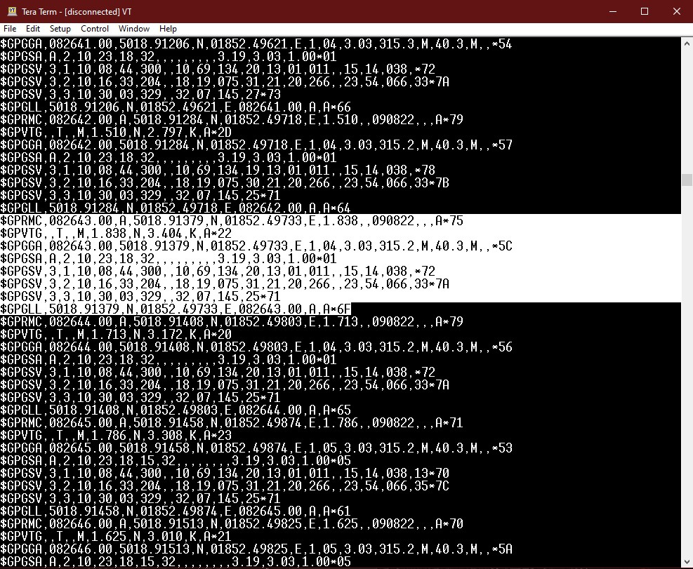
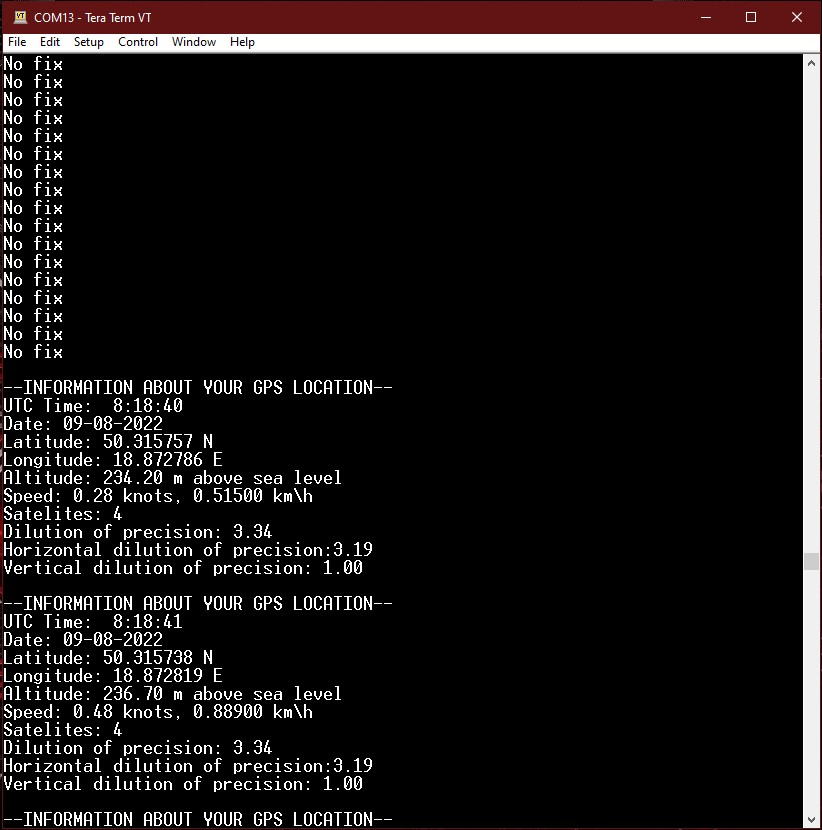

# GPS

## General info
Project is based on the nucleo f446 board and the u-blox GY-NEO6M module. 
The goal of this project is to convert NMEA messages transmitted by Neo6 
into human understandable information.

## Result

--------------------------------------------------------------------------- Before -----------------------------------------------------------------------

In this case the module is connected to USB-UART converter. Messages are printed 
on terminal directly from NEO_6

--------------------------------------------------------------------------- After -----------------------------------------------------------------------

Here, module is connected to Nucleo board and program displays trough virtual COM port all info. 

## Software
* STM32CubeIDE 1.9.0
* Tera Term

## Hardware
* Nucleo F446RE
* PL2303 (USB-UART converter)
* GY-NEO6MV2 with external antenna
