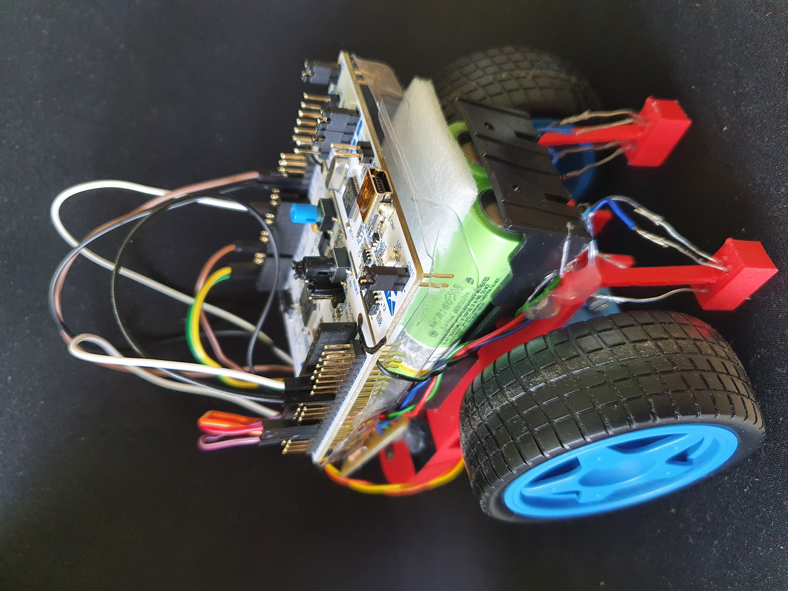

# Linefollower

## General info
Linefollower is my first project based on STM32 microcontroller. The program is written in C language 
with the HAL library, but it was written by me and not generated by CUBE_MX. GPIO initialization
was written using registers (gpio.h and gpio.c files). I designed the PCB in the Altium Designer program, 
and made using the thermal transfer method. The structural parts were designed in Fusion 360 and printed on my 3D printer.

You can see how this work by clicking on link: https://youtube.com/shorts/XXA2dq9Troc

## Software
Project is created with:
* STM32CubeIDE 1.9.0
* Altium Designer 22
* Autodesk Fusion 360

You can see screenshots project of these programs in the images folder.

## Hardware
* Nucleo F446RE
* L293D
* 2x sensor(which contains 1 IR diode and 1 phototransistor)
* 2x dc engine with gear
* 2x 18650 battery

## Result

