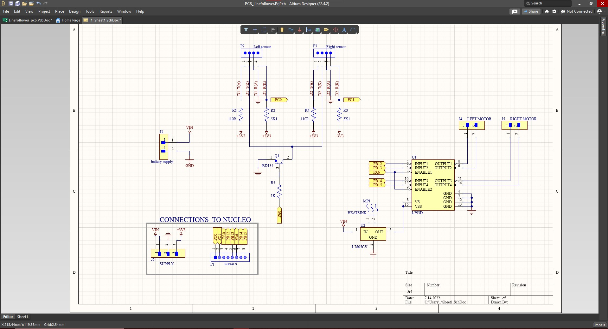
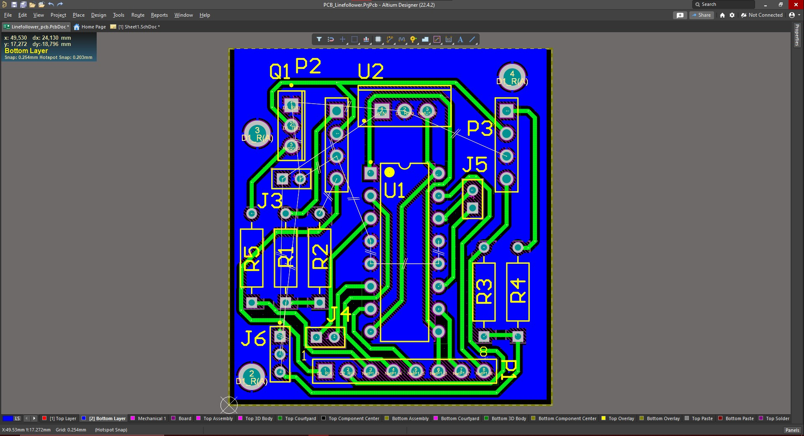

# Linefollower

## General info
Linefollower is my first project based on STM32 microcontroller. The program is written in C language 
with the HAL library, but it was written by me and not generated by CUBE_MX. GPIO initialization
was written using registers (gpio.h and gpio.c files). I designed the PCB in the Altium Designer program, 
and made using the thermal transfer method. The structural parts were designed in Fusion 360 and printed on my 3D printer

## Software
Project is created with:
* Altium Designer 22
* STM32CubeIDE 1.9.0
* Autodesk Fusion 360

## Hardware
* Nucleo F446RE
* L293D
* 2x sensor(which contains 1 IR diode and 1phototransistor)
* 2x dc engine with gear
* 2x 18650 battery

## Result

### Altium

