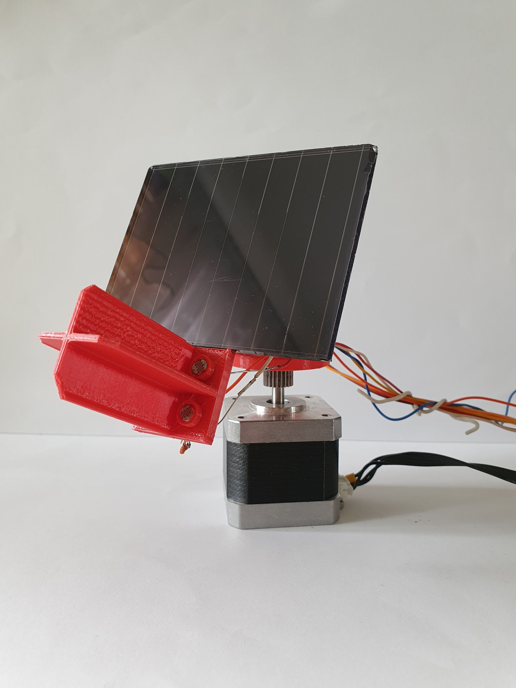

# Solar tracker

## General info

This project presents a model of solar tracker. In the base is used a stepper motor, which is responsible 
for  left or right rotation. Moving up and down is possible thanks to the servo. The roles of sensors is played by 
photoresistors connected to the ADC of microcontroller(using a voltage divider). The stepper motor is controlled 
by TMC2209 which i borrowed (and motor as well) from my 3D printer.
Voltage supply: 
- nucleo board 5V (USB from computer)
- servo 5V
- stepper motor 12V 
- TMC2209 logic voltage 3,3V
- TMC2209 motor voltage 12V

You can see how this work by clicking on link: https://youtu.be/V5lO-JHlOgE

## Software

* STM32CubeIDE 1.9.0

## Hardware
* Nucleo F446RE board
* TMC2209 stepper motor driver
* 4x Photoresistor
* 4x Resistor 2K2
* Servo SG90
* Stepper motor NEMA17

## Result

